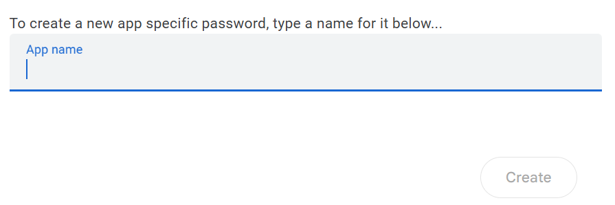
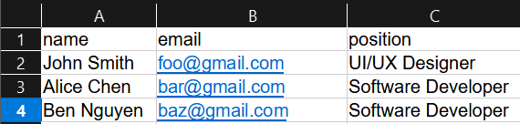

# Bulk email sender
A Python application that utilises `openpyxl` to retrieve data from an Excel sheet, and `smtplib` to send specialised emails in quick succession.

### Table of contents
- [Dependencies](#dependencies)
- [Setup](#setup)
- [Program](#program)

## Motivation
In our digitalised world, we heavily rely on electronic mail for formal communication, marketing, newsletters, and other business purposes.

Sometimes, we would like to send the same message to different individuals. For example, sending a rejection letter template, but including the candidate's name and position he/she was rejected from.

## Dependencies
1. [Simple Mail Transfer Protocol](https://en.wikipedia.org/wiki/Simple_Mail_Transfer_Protocol) (SMTP) Library, or [`smtplib`](https://docs.python.org/3/library/smtplib.html) is a package included in [The Python Standard Library](https://docs.python.org/3/library/index.html). SMTP works by establishing a [Transmission Control Protocol](https://www.geeksforgeeks.org/what-is-transmission-control-protocol-tcp/) (TCP) connection between the client and the SMTP server. If [Transport Layer Security](https://en.wikipedia.org/wiki/Transport_Layer_Security) (TLS) is used, the server listens on port 587 and processes the request.

```
# Establishing SMTP connection
server = smtplib.SMTP("smtp.gmail.com", 587)
# Enable Transport Layer Security (TLS)
server.starttls()
```

2. [`openpyxl`](https://pypi.org/project/openpyxl/) is a library from the Python Package Index to perform file I/O on Excel (xlsx/xlsm/xltx/xltm) files.

3. [`sys`](https://docs.python.org/3/library/sys.html) is another package already included in The Python Standard Library, which provide system-specific functions.

## Setup
Firstly, you need a google account with 2-Factor Authentication. SMTP is an old protocol, thus Google requires an app-password set up to allow a less secure application to access your account.

Go to Account -> Search for "App passwords". Generate the password by assigning a name.



Write down the 16-digit app password for reference.

## Program

### main.py
main.py contains code that establishes the connection to the SMTP server, logs in, sends the request, and read Excel data.

Configure the sender email and app password, then login using server.login():
```
# Configuring details
sender = "sender@gmail.com"
app_password = "abcd efgh ijkl mnop"

try:
    server.login(sender, app_password)
except smtplib.SMTPAuthenticationError:
    print("Error signing in, check that the login details are correct")
    sys.exit()
else:
    print("Login successful.")
```

Create an excel sheet, and fill it up according to the template shown. It is imperative that the template is properly followed else the code will not work.



Now, load the workbook by specifying the file name within `openpyxl.load_workbook()`. Afterwards, create a worksheet object `ws` using the sheet name as follows:

```
# Loading Excel data
wb = openpyxl.load_workbook("rejected_applicants.xlsx")
ws = wb["Sheet1"]
```

Using a while loop, I iterate through every row, except the header (index starts from 2) until the value eventually returns `None`. This signifies the last entry has been iterated, hence breaking the loop.

```
index = 2
emails_sent = 0
while True:
    name = ws[f"A{index}"].value
    recipient = ws[f"B{index}"].value
    position = ws[f"C{index}"].value

    # Check if the last value is reached by checking for None
    if name is None:
        break
    
    # send the message!
    index += 1
```

To send an email, you need a message. This formatted string variable `message` allows you to specify the necessary parameters. Ensure that there is no unnecessary indentation else the text will not wrap correctly.
```
    message = f"""From: {sender}
To: {recipient}
Subject: {subject}\n
{rejection_email_template(name, position)}
"""
```

The function rejection_email_template() returns a string which is the body of the email. The body will always be under the subject.

After setting up your `message`, you have to send a request to the SMTP server. Here is how you do it:
```
server.sendmail(sender, recipient, message)
```

### email_templates.py
This Python file stores the email templates. To create a template, simply create a function with parameters and ensure that the function returns a formatted string.

For example:
```
def rejection_email_template(name, position):
    body = f"""your text here {name}, {position}
"""
    return body
```

